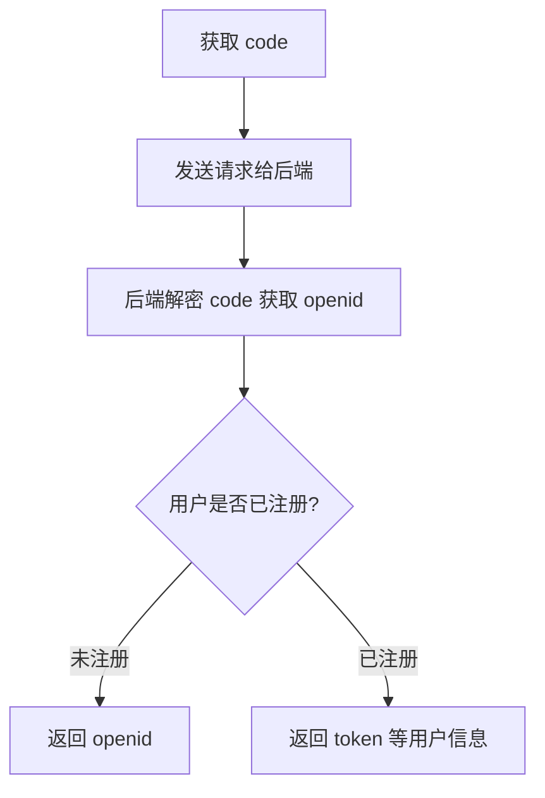

# 微信小程序一键登录分享讲义

## 项目文件夹的目录结构机器各个文件夹的作用

```
|-- node_modules/            # 环境依赖
|-- uni_modules/             # 存放[uni_module](/uni_modules)
|-- components/              # 存放可复用组件的目录
|   `-- comp-a.vue           # 可复用组件 a
|-- api/                     # 封装接口目录
|   `-- config.js            # 二次封装uni.request或者axios
|   `-- api/                 # 页面接口的管理目录
|       `--aaa.js            # 存放某一个页面的接接口
|-- pages/                   # 存放业务页面的目录
|   |-- index/               # 存放 index 页面的目录
|   |   `-- index.vue        # index 页面组件
|   |   `--index1.vue        # index页面的子组件
|   |   `--index2.vue        # index页面的子组件
|   `-- list/                # 存放 list 页面的目录
|       `-- list.vue         # list 页面组件
|-- utils                    # 存放封装的方法
|   `--setToken.js
|-- static/                  # 存放应用引用的静态资源（如图片、视频等）的目录，注意只能存放于此
|   `-- ...
|-- store/                   # 存储数据和管理数据方法的仓库
|   `-- ...
|-- unpackage                # 打包文件目录
|-- main.js                  # Vue 初始化入口文件
|-- index.html               # Vue 初始化入口页面
|-- App.vue                  # 应用配置文件，用来配置全局样式和生命周期函数等
|-- package.json             # 插件管理文件
|-- package-lock.json        # 插件版本锁定文件
|-- manifest.json            # 配置应用名称、AppId、logo、版本等打包信息
|-- uni.scss                 # 内置样式文件
|-- pages.json               # 配置页面路径、页栈等页面相关信息
```

## 上传GitHub仓库的一些注意事项

- 上传GitHub仓库应在根目录下有一个.gitignore文件，在其中配置--目的忽略一些不必要的文件上传

  ```
  node_modules/
  .project
  unpackage/
  .DS_Store
  wxcomponents/**/*.vue
  wxcomponents/**/*.css
  .hbuilderx/
  ```

  注意：node_modules文件夹是不需要上传的，uni_modules文件夹是需要上传的

- 如果之前就已经提交过unpackage文件夹，那需要执行以下命令行：

  ```
  git rm -r --cached unpackage(需要删除的文件名称)
  ```

  注意：默认unpackage是在代码仓库的根目录下，如果不是在根目录下可以灵活的修改文件的位置，例如：

  ```
  git rm -r --cached ./BoundlessUniverse/BoundlessUniverseFrontend/unpackage
  随后需要重新上传一次GitHub的代码仓库
  git commit -m"xxxx"
  git push origin xxx
  原因：当执行 git rm -r --cached 命令时，该操作仅从 Git 的索引（即暂存区）中移除了指定路径下的文件或目录，但这些改动并不会立即同步至远程仓库
  ```

## 微信小程序一键登录的分享

### 一键登录的3种方式

- ### 小程序授权登录

  通过uni.login或wx.login获取 临时登录凭证，向后端换取token。

- ### 手机号授权登录

  过button按钮的@getphonenumber事件，弹出手机号授权，获取到加密数据后，向后端换取token

- ### 用户信息授权登录

  通过button按钮的click事件，调用 wx.getUserProfile() 弹出授权框，获取到用户加密数据后，向后端换取token

这次分享中的微信小程序登录是通过第一种方法来登录的，但是需要获取用户的手机号来进行注册，第二种方式也会涉及到

### 必要的准备工作

- 创建uniapp项目，更新appid（小程序ID）--保证能调用微信小程序的api
- 与后端保持一致的appid（小程序ID）以及 appsecret(小程序密钥)-- 保证能够拿到openid或用户信息
- 在小程序的管理后台设置ip白名单以及合法域名，或者，在开发的时候使用ip地址作为前缀，在微信开发者工具中打开不校验合法域名、web-view（业务域名）、TLS版
  本以及HTTPS证书--这样才能成功的发送请求
- 如果要使用域名则需要提前一个月备案

### 接口的二次封装以及接口管理

- 二次封装axios请求

  ```js
                                                                                                  //基础路径
  const baseURL="https://test.com/api"
  //请求超出时间
  const timeOUT=5000
  
  //获取token
  import  { getToken } from '@/utils/setToken.js'
  
  //发送请求
  export const request=(params={})=>{
  		//获取token
  		let token=getToken()
  		//解构数据
  		let url = params.url
  		let method = params.method || 'GET'
  		let data = params.data || {}
  		return new Promise((resolve, reject) => {
  			uni.request({
  				url: baseURL + url,
  				method: method,
  				header: {
  					Authorization:token
  				},
  				data: data,
  			}).then(res=>{
  				let { data,statusCode }=res
           		//单独处理状态码401--token过期
  				if(statusCode==401){
  					uni.removeStorageSync('token')
  					uni.removeStorageSync('ID')
  					uni.navigateTo({
  						url:"/pages/login/login"
  					})
  				}
  				resolve(res)
  			}).catch(err=>{
  				reject(err)
  			})
  		})
  }
  ```

  

- 登录接口管理

  ```javascript
  //登录接口管理
  
  import { request } from "@/api/config.js"
  
  //获取code --用户已存在，返回用户数据；用户不存在，返回加密后的openid
  export function isActiveUser(code){
  	return request({
  		url:"/wx_login/?code="+code,
  		method:"GET"
  	})
  }
  
  //获取手机号，通过getPhoneNumber获取的code
  export function getPhone(code){
  	return request({
  		url:"/user/get_phone/?code="+code,
  		method:"GET"
  	})
  }
  
  //注册用户接口
  export function register(data){
  	return request({
  		url:"/wx_login/",
  		method:"POST",
  		data:data
  	})
  }
  ```

### 一键登录的时序图


### 一键登录的3种方式的显示demo


- 小程序授权登录

  ```javascript
  const getOpenid=async ()=>{
  	try{
  		const loginRes = await uni.login({
  			provider: 'weixin'
  		})
  		console.log(loginRes)
  	}catch(err){
  		console.log(err)
  	}
  	
  	const code=loginRes.code
  	isActiveUser(code)
  	.then(res=>{
  		console.log(res)
  		//解构数据
  		const {
  			statusCode,
  			data
  		} = res
  		//若返回的是openid继续注册，若没有oepnid，那么用户已经注册过，点击跳转到首页
  		if (statusCode == 200) {
  			if (data.openid) {
  				//走注册流程
  				........
  			} else {
  				//存储用户ID
  				const id = data.user_id
  				setID(id)
  				//存储token
  				const token = 'Bearer' + ' ' + data.token
  				setToken(token)
  				uni.showToast({
  					title: '用户已经注册,\n即将到达首页',
  					icon: 'success',
  					duration: 2000
  				});
  				setTimeout(function() {
  					uni.switchTab({
  						url: '/pages/index/index',
  						success() {
  							let page = getCurrentPages().pop();
  							if (page == undefined || page == null) return;
  							page.onLoad();
  						}
  					})
  				}, 1000)
  			}
  		} else {
  			uni.showToast({
  				title: data.detail,
  				icon: 'error',
  				duration: 2000,
  			})
  		}
  	})
  	.catch(err=>{
  		console.log(err);
  	})
  	// const loginRes=await wx.login()
  	// console.log(loginRes);
  }
  ```

  - uni.login()或wx.login()返回的结果

    ```
    {
    	code: "0d33P9000r5byT1eEz300DiyLa13P90c"
    	errMsg: "login:ok"
    }
    ```

  - 利用code与后端获取结果

    - 若返回openid则用户没有没有注册过--走注册流程
    
    - 若返回token等信息则用户已经注册，跳转到首页
    
      返回openid的结果
    
      ```
      {
      	accelerateType: "none",
      	cookies: [],
      	data:{
      		openid:"xxxx",
      	},
      	errMsg: "request:ok",
      	header:{
      		Allow: "GET, POST, HEAD, OPTIONS"
      		Cache-Control: "no-cache"
      		Connection: "keep-alive"
      		Content-Length: "404"
      		Content-Type: "application/json"
      		Cross-Origin-Opener-Policy: "same-origin"
      		Date: "Thu, 16 Jan 2025 07:46:05 GMT"
      		Referrer-Policy: "same-origin"
      		Server: "nginx"
      		Vary: "Accept, origin"
      		X-Content-Type-Options: "nosniff"
      		appservice-request-id: "1267"
      	},
      	statusCode: 200
      }
      ```
    
      返回token等信息的结果
    
      ```
      {
      	accelerateType: "none",
      	cookies: [],
      	data:{
      		integral: 0
      		is_active: false
      		token:"xxxxx"
      		user_id: 292
      		using_badge: 1
      		using_badge_name: "宇宙起步者"
      		using_nickname: "yy"
      		using_wristband: "102B74EC20040B8DED4F"
      	},
      	errMsg: "request:ok",
      	header:{
      		Allow: "GET, POST, HEAD, OPTIONS"
      		Cache-Control: "no-cache"
      		Connection: "keep-alive"
      		Content-Length: "404"
      		Content-Type: "application/json"
      		Cross-Origin-Opener-Policy: "same-origin"
      		Date: "Thu, 16 Jan 2025 07:46:05 GMT"
      		Referrer-Policy: "same-origin"
      		Server: "nginx"
      		Vary: "Accept, origin"
      		X-Content-Type-Options: "nosniff"
      		appservice-request-id: "1267"
      	},
      	statusCode: 200
      }
      ```
    
      

- 手机号授权登录

  ```javascript
  const getPhoneNumber=async(e)=>{
  	// console.log(e);
  	try{
  		const res= await getPhone(e.detail.code)
  		//解构数据
  		const {
  			statusCode,
  			data
  		} = res
  		if (statusCode == 200) {
  			// console.log(res);
  			form.phone = data.phone
  		} else {
  			uni.showToast({
  				title: data.detail,
  				icon: 'error',
  				duration: 2000,
  			})
  		}
  	}catch(err){
  		console.log(err)
  	}
  	
  }
  
  const userRegister=async ()=>{
  	try{
  		const res= await register(form)
  		//解构数据
  		const {
  			statusCode,
  			data
  		} = res
  		if (statusCode == 200) {
  			//存储用户ID
  			const id = data.user_id
  			setID(id)
  			//存储token
  			const token = 'Bearer' + ' ' + data.token
  			setToken(token)
  			uni.showToast({
  				title: '用户已经注册,\n即将到达首页',
  				icon: 'success',
  				duration: 2000
  			});
  			setTimeout(function() {
  				uni.switchTab({
  					url: '/pages/index/index',
  					success() {
  						let page = getCurrentPages().pop();
  						if (page == undefined || page == null) return;
  						page.onLoad();
  					}
  				})
  			}, 1000)
  		} else {
  			uni.showToast({
  				title: data.detail,
  				icon: 'error',
  				duration: 2000,
  			})
  		}
  	}catch(err){
  		console.log(err)
  	}
  	
  }
  ```

  - 利用getPhoneNumber获取的code与后端获取手机号

    - getPhoneNumber返回的结果--部分

    ```
    {
     	....
     	detail:{
     		code: "430f44cdc261180fc2a808c9e682ab90b6b7c0bf2f3e4a17b392c9ae48d1855e"
    		encryptedData: "xxxx"
    		errMsg: "getPhoneNumber:ok"
    		iv: "VrVoDpAzpOAlfPor5KP+Tg=="
     	}
     	......
    }
    ```

    - 利用code与后端获取的结果

      ```
      {
      	accelerateType: "none",
      	cookies: [],
      	data:{
      		phone: "1399xxxxxxxx"
      	},
      	errMsg: "request:ok",
      	header:{
      		Allow: "GET, POST, HEAD, OPTIONS"
      		Cache-Control: "no-cache"
      		Connection: "keep-alive"
      		Content-Length: "404"
      		Content-Type: "application/json"
      		Cross-Origin-Opener-Policy: "same-origin"
      		Date: "Thu, 16 Jan 2025 07:46:05 GMT"
      		Referrer-Policy: "same-origin"
      		Server: "nginx"
      		Vary: "Accept, origin"
      		X-Content-Type-Options: "nosniff"
      		appservice-request-id: "1267"
      	},
      	statusCode: 200
      }
      ```

      

- 用户信息授权登录--项目中没有用到

  ```js
  <template>
  	<view class="content">
  		<image src="logo.png"></image>
  		<view class="title">申请获取以下权限</view>
  		<text class="msg">获取你的公开信息（昵称、头像、地区等）</text>
  		<!-- #ifdef MP-WEIXIN -->
  		<button class="btn" @click="wxgetUserInfo">授权登录</button>
  		<!-- #endif -->
  		<!-- #ifdef MP-ALIPAY -->
  		<button class="btn" open-type="getAuthorize" @getAuthorize="alipaygetUserInfo" @error="onAuthError" scope='userInfo'>授权登录</button>
  		<!-- #endif -->
  	</view>
  </template>
  
  <script>
  	import { loginByWx, loginByAlipay } from '@/api/user.js'
  	export default {
  		data() {
  			return {
  				code: new String()
  			}
  		},
  		async onLoad() {
  			this.code = await this.getAppCode()
  		},
  		methods: {
  			// 获取微信用户信息
  			async wxgetUserInfo() {
  				try {
  					// 微信登录
  					// #ifdef MP-WEIXIN
  					let userData = await this._getwxUserData()
  					// 调用后台接口登录
  					let loginRes = await this.appLogin(userData)
  					// savecache
  					uni.setStorageSync('isLogin', true)
  					uni.setStorageSync('userInfo', {
  						headImg: loginRes.headImg,
  						userName: loginRes.userName
  					});
  					uni.setStorageSync('token', loginRes.token)
  					uni.setStorageSync('userId', loginRes.userId)
  					uni.navigateBack({
  						delta: 1
  					});
  					// #endif					
  				} catch(err) {
  					this.onAuthError()
  				}
  			},
  			// 支付宝用户登录
  			async alipaygetUserInfo() {
  				try {
  					// 支付宝登录
  					// #ifdef MP-ALIPAY
  					let userData = await this._getalipayUserData()
  					// 调用后台接口登录
  					let loginRes = await this.appLogin(userData)
  					loginRes.userName = userData.nickName
  					loginRes.headImg = userData.avatar
  					// savecache
  					uni.setStorageSync('isLogin', true)
  					uni.setStorageSync('userInfo', {
  						headImg: loginRes.headImg,
  						userName: loginRes.userName
  					})
  					uni.setStorageSync('token', loginRes.token)
  					uni.setStorageSync('userId', loginRes.userId)
  					uni.navigateBack({
  						delta: 1
  					})
  					// #endif					
  				} catch(err) {
  					this.onAuthError()
  				}
  			},
  			// 授权失败
  			onAuthError() {
  				uni.showToast({
  					title: '授权失败，请确认授权已开启',
  					mask: true,
  					icon: 'none'
  				})
  			},
  			// 获取支付宝用户加密数据
  			_getalipayUserData() {
  				return new Promise((resolve, reject) => {
  					my.getOpenUserInfo({
  						success: res => {
  							let userInfo = JSON.parse(res.response).response
  							resolve(userInfo)
  						},
  						fail: err => {
  							reject(err)
  						}
  					})
  				})
  			},
  			// 获取微信用户加密数据
  			_getwxUserData() {
  				// 用户信息接口调整，使用uni.getUserInfo() 获取到的用户信息是一个灰色的头像和微信用户
  				// 需要使用 uni.getUserProfile() 获取用户信息，此方法需要按钮触发 @click=func
  				return new Promise((resolve, reject) => {
  					uni.getUserProfile({
  						desc: '完善用户信息',
  						success: data => {
  							console.log("用户信息：", data)
  							resolve(data)
  						},
  						fail: err => {
  							reject(err)
  						}
  					})
  				})
  			},
  			// 获取 临时登录凭证code
  			getAppCode() {
  				return new Promise((resolve, reject) => {
  					// #ifdef MP-WEIXIN
  					uni.login({
  						provider: 'weixin',
  						success(res) {
  							resolve(res.code)
  						},
  						fail(err) {
  							reject(err)
  						}
  					})
  					// #endif
  					// #ifdef MP-ALIPAY
  					// 系统建议使用支付宝原生写法
  					my.getAuthCode({
  					  scopes: 'auth_base',
  					  success(res) {
  					  	resolve(res.authCode)
  					  },
  					  fail(err) {
  					  	reject(err)
  					  }
  					 })
  					// #endif
  				})
  			},
  			// 用户登录
  			appLogin(detail) {
  				return new Promise(async(resolve, reject) => {
  					try {
  						// 微信登录
  						// #ifdef MP-WEIXIN
  						let params = {
  							code: this.code,
  							source: 'MP',
  							encryptedData: detail.encryptedData,
  							iv: detail.iv
  						}
  						let wxloginRes = await loginByWx(params)
  						if(wxloginRes.code == 200) {
  							resolve(wxloginRes.data)
  						} else {
  							reject(wxloginRes)
  						}
  						// #endif
  						// #ifdef MP-ALIPAY
  						// 系统建议使用支付宝原生写法
  						let alipayloginRes = await loginByAlipay({
  							code: this.code
  						});
  						if(alipayloginRes.code == 200) {
  							resolve(alipayloginRes.data)
  						} else {
  							reject(alipayloginRes)
  						}
  						// #endif
  					} catch(err) {
  						reject(err)
  					}
  				});
  			},
  		}
  	}
  </script>
  
  <style lang="less">
  	view, text, image, input {
  		box-sizing: border-box;
  	}
  	
  	.content {
  		position: relative;
  		display: flex;
  		flex-direction: column;
  		align-items: center;
  		width: 100%;
  		height: 100vh;
  		padding: 160rpx 40rpx 0;
  		
  		image {
  			width: 275rpx;
  			height: 104rpx;
  		}
  		.title {
  			width: 100%;
  			margin-top: 80rpx;
  			font-size: 30rpx;
  			font-weight: 600;
  			color: rgba(0, 0, 0, 0.85);
  			text-align: left;
  		}
  		.msg {
  			display: block;
  			width: 100%;
  			margin-top: 16rpx;
  			font-size: 28rpx;
  			color: rgba(0, 0, 0, 0.65);
  			text-align: left;
  		}
  		
  		.btn {
  			position: absolute;
  			bottom: 160rpx;
  			width: 670rpx;
  			height: 96rpx;
  			background: #00B391;
  			border-radius: 8rpx;
  			font-size: 34rpx;
  			font-weight: 400;
  			color: #FFFFFF;
  			line-height: 96rpx;
  		}
  	}
  </style>
  
  
  ```

### 一键登录的3种方式的流程图

通过 `wx.login()` 或 `uni.login()` 获取 `code`，通过 `uni.request()` 发送请求给后端，后端解密后判断用户是否注册，分别返回不同的信息。



### 注意事项

- uni.login（）或wx.login（）获取的code与getPhoneNumber获取的e.detail.code两者是不一样的，前者用于获取用户在微信小程序中的唯一标识openid，用户在不同小程序中openid不一样，同一个项目更换appid之后，用户也需要重新注册

- Uni.login() 支持各种小程序以及app，不支持web端，wx.login()支持微信小程序

- getPhoneNumber获取手机号是有次数限制的，免费使用900次，之后则需要收费

- 获取手机号的按钮必须写成以下形式，不能使用click事件，也不能使用模拟点击触发，只能通过实际的点击触发

  ```
  <button open-type="getPhoneNumber" @getphonenumber="getPhoneNumber">获取手机号</button>
  ```

- wx.getUserProfile()与uni.getUserInfo()  和 wx.login() 与 uni.login () 返回的数据都相同，但后者同样可以适用于app

- uni.getUserInfo() 和 wx.getUserProfile() 可以获取的基本用户信息包括：用户昵称 用户头像 用户性别,获取敏感信息，例如：城市，国家等等则需要其他返回的数据，与微信提供的接口进行解密才可以得到

- 获取小程序二维码，获取openid，获取用户敏感信息，微信api均提供了两种方式

  - 开发者后台校验与解密开放数据

  - （云调用）直接获取开放数据（云开发）

    前者是前端获取加密的code，给后端，后端解密之后再返回给前端，后者是前端获取加密的code之后，直接调用接口，进行解密，推荐使用前者，前端如果直接调用接口获取敏感信息容易被逆向，进而造成危害

- 注意v-show 和 v-if 的区别 ：

  - 相同点：两者都是控制元素是否显示的
  - 不同点：前者元素不显示也会在dom树上挂载，后者元素不显示不会在dom树上挂载

### 涉及到的api的官方文档链接

- uni.login():https://zh.uniapp.dcloud.io/api/plugins/login.html
- Wx.login():https://developers.weixin.qq.com/miniprogram/dev/api/open-api/login/wx.login.html
- 手机号快速验证组件：https://developers.weixin.qq.com/miniprogram/dev/framework/open-ability/getPhoneNumber.html
- wx.getUserProfile()：https://developers.weixin.qq.com/miniprogram/dev/api/open-api/user-info/wx.getUserProfile.html

